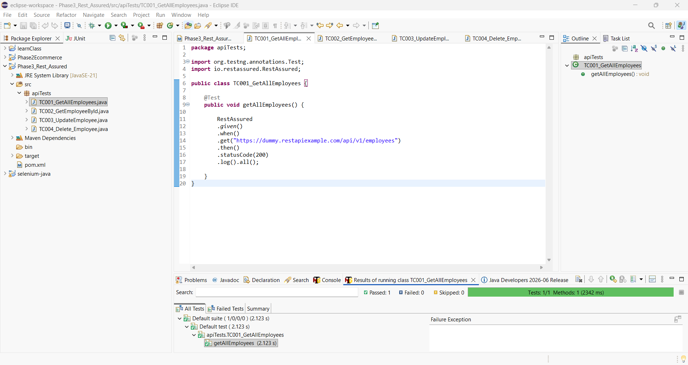
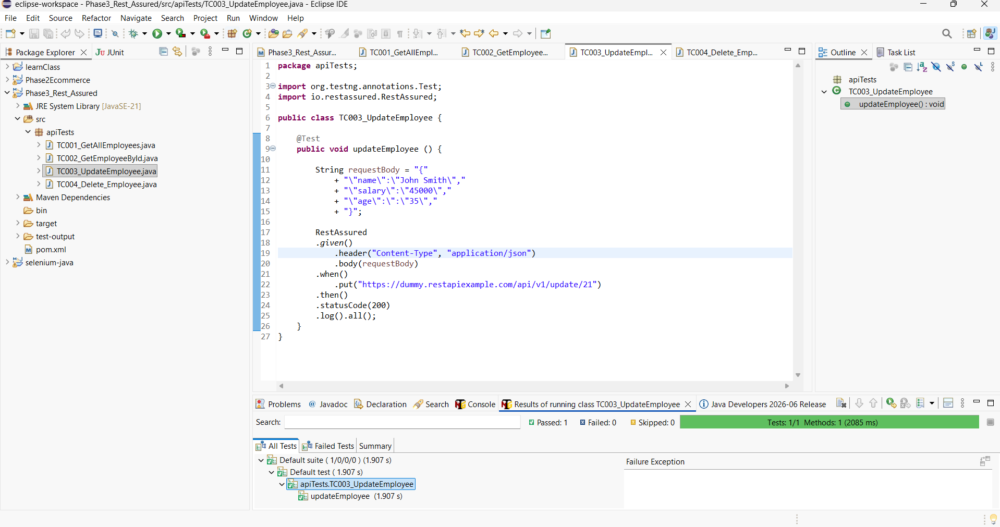
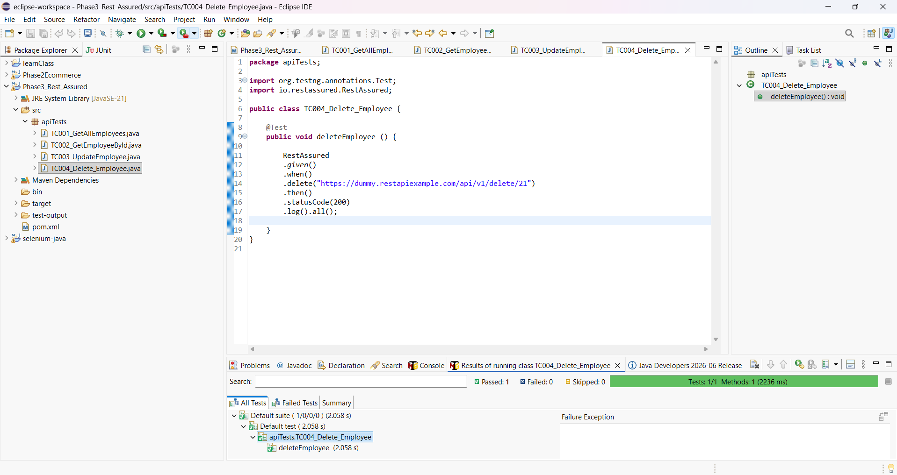
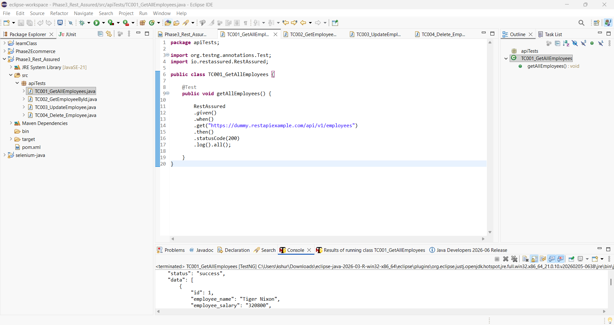
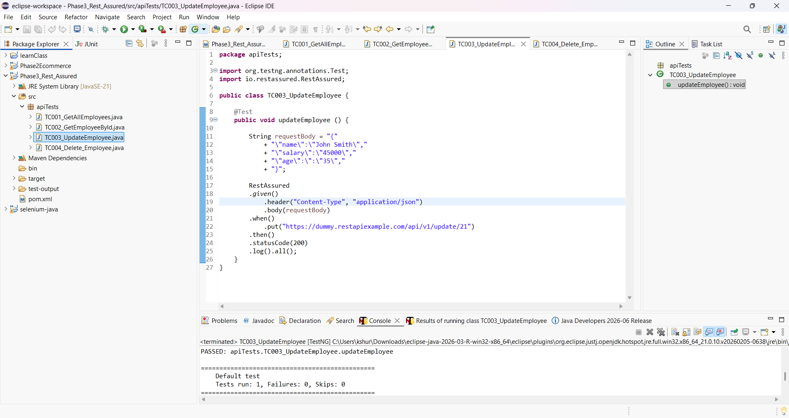
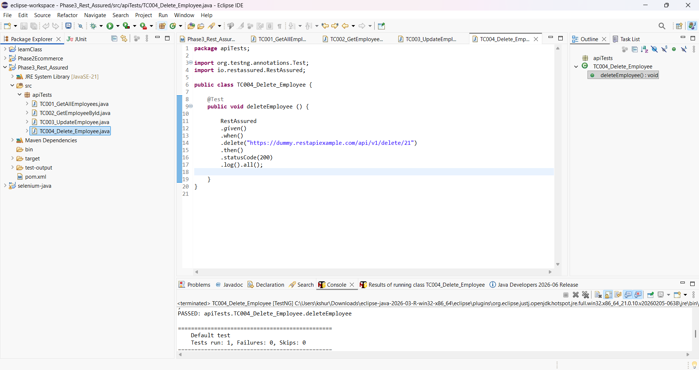

# 🚀 Rest Assured API Automation

REST Assured API Automation Framework demonstrating REST API testing with Java, TestNG, Maven, assertions, JSON validation and API test evidence.


---

# 📌 Project Overview

This project demonstrates REST API automation using **REST Assured** and a **Dummy REST API**.

The framework includes:

- REST Assured API Testing
- Java
- TestNG Framework
- Maven Project
- HTTP Request Validation
- HTTP Status Code Validation
- JSON Response Validation
- Assertions
- API Test Evidence

---

# 🛠️ Tools & Technologies

- REST Assured
- Java
- Maven
- TestNG
- JSON
- REST API
- Eclipse IDE
- Git
- GitHub

---

# 📂 Project Structure

```text
Rest-Assured-API-Automation
│
├── Rest_Assured
│   ├── TC001_GET_AllEmployees_API_Response.png
│   ├── TC002_GET_EmployeeById_API_Response.png
│   ├── TC003_PUT_UpdateEmployee_API_Response.png
│   └── TC004_DELETE_Employee_API_Response.png
│
├── Evidence
│   ├── TC001_GET_AllEmployees_TestNG_Passed.png
│   ├── TC002_GET_EmployeeById_TestNG_Passed.png
│   ├── TC003_PUT_UpdateEmployee_TestNG_Passed.png
│   └── TC004_DELETE_Employee_TestNG_Passed.png
│
└── README.md
```

---

# ✅ Test Scenarios

| Test Case | Description |
|-----------|-------------|
| TC001 | GET All Employees |
| TC002 | GET Employee By ID |
| TC003 | PUT Update Employee |
| TC004 | DELETE Employee |

---

# 📷 TestNG Execution

## TC001 - GET All Employees



---

## TC002 - GET Employee By ID


---

## TC003 - PUT Update Employee



---

## TC004 - DELETE Employee



---

# 🌐 API Responses

## TC001 - GET All Employees



---

## TC002 - GET Employee By ID


---

## TC003 - PUT Update Employee



---

## TC004 - DELETE Employee



---

# ▶️ How to Run

1. Clone this repository.
2. Open the project in Eclipse or IntelliJ IDEA.
3. Update Maven dependencies.
4. Configure the API endpoint if required.
5. Execute the TestNG test suite.
6. Verify all tests pass successfully.
7. Review the API response screenshots and TestNG execution evidence.

---

# 🎯 Learning Outcomes

This project demonstrates practical experience with:

- REST Assured
- Java
- Maven
- TestNG
- REST API Automation
- API Assertions
- JSON Validation
- HTTP Status Code Validation
- Response Verification
- API Test Documentation
- GitHub Portfolio Management

---

## 👨‍💻 Author

**Krishan Shura**

ISTQB Certified Software Tester | Manual & Automation QA Engineer

GitHub: https://github.com/KS6000
